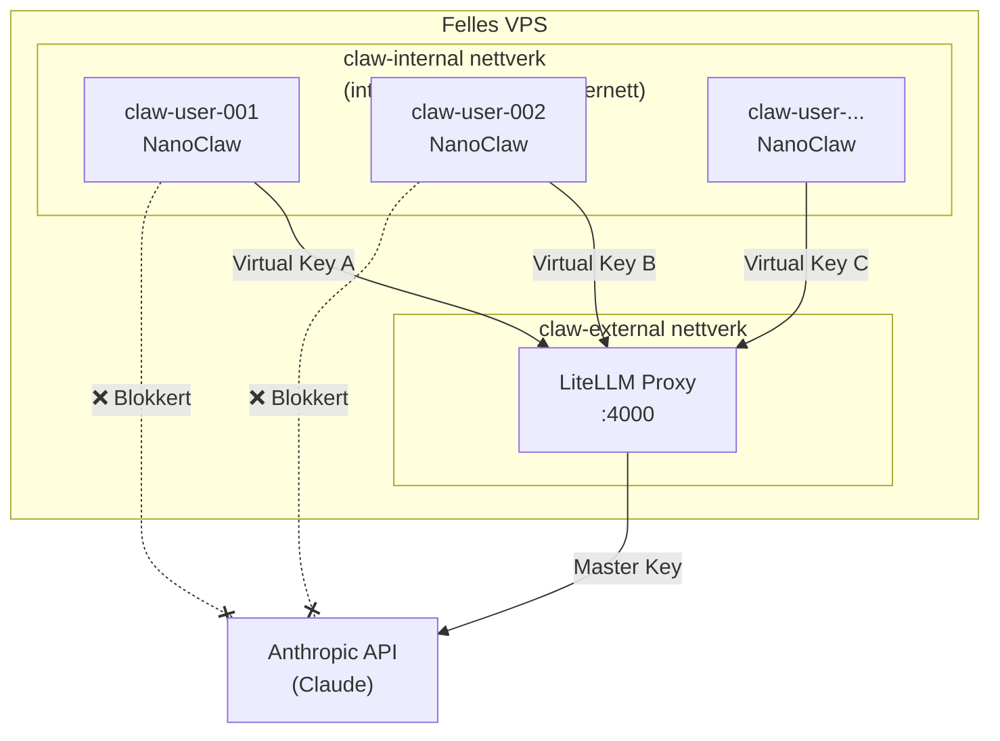

# Fase 1: Infrastruktur & LiteLLM Proxy — Walkthrough

## Hva ble gjort

Vi implementerte **Fase 1** av Claw Personal / NanoClaw-plattformen: grunnleggende Docker-infrastruktur med LiteLLM som intern AI-proxy.

### Opprettede filer

| Fil | Formål |
|-----|--------|
| [docker-compose.yml](file:///Users/thomasuthaug/Desktop/Nrth%20AI%20-%20Claw%20Personal/docker-compose.yml) | Docker Compose med LiteLLM proxy og to nettverk (internt + eksternt) |
| [litellm/config.yaml](file:///Users/thomasuthaug/Desktop/Nrth%20AI%20-%20Claw%20Personal/litellm/config.yaml) | LiteLLM-konfigurasjon med modellaliaser og master key |
| [.env.example](file:///Users/thomasuthaug/Desktop/Nrth%20AI%20-%20Claw%20Personal/.env.example) | Mal for miljøvariabler (API-nøkler) |
| [.gitignore](file:///Users/thomasuthaug/Desktop/Nrth%20AI%20-%20Claw%20Personal/.gitignore) | Beskytter hemmeligheter fra versjonskontroll |
| [scripts/create-virtual-key.sh](file:///Users/thomasuthaug/Desktop/Nrth%20AI%20-%20Claw%20Personal/scripts/create-virtual-key.sh) | Skript for å opprette Virtual Keys per bruker |
| [scripts/start-user-container.sh](file:///Users/thomasuthaug/Desktop/Nrth%20AI%20-%20Claw%20Personal/scripts/start-user-container.sh) | Skript for å spinne opp isolerte brukercontainere |

### Arkitektur

**Nøkkelbeslutninger:**
- **To separate nettverk:** `claw-internal` (lukket, `internal: true`) for brukercontainere, og `claw-external` for LiteLLM sin utgående trafikk. Brukercontainere kan *ikke* nå internett direkte.
- **Virtual Keys:** Hver brukercontainer får sin egen midlertidige nøkkel med budsjettgrenser, opprettet via LiteLLM sitt admin-API.
- **Ressursbegrensning:** Brukercontainere er begrenset til 512 MB RAM og 0.5 CPU (konfigurerbart).
- **Localhost-eksponering:** Port 4000 er kun tilgjengelig på `127.0.0.1` for admin/debugging.

### Verifisering

- ✅ Alle YAML-filer er syntaktisk korrekte
- ✅ Shell-skript har korrekt shebang og er kjørbare
- ✅ `.env.example` inneholder alle nødvendige variabler
- ✅ `.gitignore` beskytter `.env`-filer
- ⚠️ Docker er ikke installert på utviklingsmaskinen — full test krever en VPS med Docker

### Neste steg

For å ta dette i bruk:

1. **Sett opp VPS:** Installer Docker og Docker Compose på en VPS (f.eks. Hetzner, DigitalOcean)
2. **Konfigurer hemmeligheter:** Kopier `.env.example` til `.env` og fyll inn ekte API-nøkler
3. **Start infrastrukturen:** `docker compose up -d`
4. **Test:** Kjør verifiseringsstegene fra implementeringsplanen

For **Fase 2** (Orkestratoren):
- Bygg et API (Node.js/Express eller Python/FastAPI) som tar imot webhooks
- Automatiser opprettelse av Virtual Keys og brukercontainere
- Implementer «The Vault» for sikker lagring av OAuth-tokens
