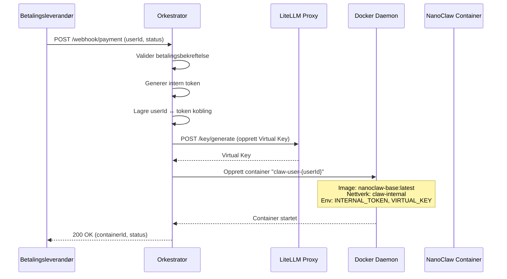

# Utvikling del 2: Backend Orkestrator for "Zero Delay"

## Bakgrunn

Vi skal bygge en sentral **Orkestrator** — en lettvekts Express-server (Node.js) som håndterer onboarding-flyten. Orkestratoren er hjertet i Control Plane og har tre hovedansvarsområder:

1. **Motta betalingsbekreftelser** via webhook
2. **Spinne opp isolerte NanoClaw-containere** per bruker på under et sekund
3. **Generere og administrere interne tokens** for sikker kommunikasjon mellom containere og LiteLLM-proxyen

Eksisterende infrastruktur (fra "Utvikling del 1") inkluderer:
- `docker-compose.yml` med LiteLLM proxy-container
- `claw-internal` (lukket) og `claw-external` Docker-nettverk
- Shell-skript for opprettelse av Virtual Keys og oppstart av brukercontainere
- `.env.example` med konfigurasjon for API-nøkler

## Foreslåtte endringer

### Orkestrator-applikasjon (Node.js/Express)

> [!IMPORTANT]
> Orkestratoren bygges som en Node.js Express-server under `orchestrator/`-mappen. Vi bruker **Dockerode**-biblioteket (ikke `child_process`) for å kommunisere med Docker daemon — dette gir bedre kontroll, feilhåndtering og er mer robust enn shell-kommandoer.

#### [NEW] [orchestrator/package.json](file:///Users/thomasuthaug/Desktop/Nrth%20AI%20-%20Claw%20Personal/orchestrator/package.json)
- Node.js prosjektfil med avhengigheter:
  - `express` — HTTP-server rammeverk
  - `dockerode` — Docker API-klient for Node.js
  - `crypto` — (innebygd) for generering av tilfeldige tokens
  - `dotenv` — for lasting av miljøvariabler
  - `uuid` — for generering av unike bruker-IDer (om nødvendig)

#### [NEW] [orchestrator/src/server.js](file:///Users/thomasuthaug/Desktop/Nrth%20AI%20-%20Claw%20Personal/orchestrator/src/server.js)
- Hovedserver-fil som setter opp Express-app
- Helse-endepunkt (`GET /health`)
- Webhook-endepunkt (`POST /webhook/payment`)
- Middleware for JSON-parsing og feilhåndtering

#### [NEW] [orchestrator/src/services/docker.service.js](file:///Users/thomasuthaug/Desktop/Nrth%20AI%20-%20Claw%20Personal/orchestrator/src/services/docker.service.js)
- Dockerode-integrasjon for å spinne opp containere
- Funksjon: `spawnUserContainer(userId, internalToken)` — starter `nanoclaw-base:latest` container med navn `claw-user-{userId}`
- Containeren kobles til `claw-internal`-nettverket
- Intern token injiseres som miljøvariabel (`INTERNAL_TOKEN`)
- Oppretter også en Virtual Key via LiteLLM API og injiserer denne

#### [NEW] [orchestrator/src/services/token.service.js](file:///Users/thomasuthaug/Desktop/Nrth%20AI%20-%20Claw%20Personal/orchestrator/src/services/token.service.js)
- Generering av tilfeldige interne tokens (`crypto.randomBytes`)
- Lagring av kobling mellom `userId` og `internalToken` (i-minne Map med mulighet for utvidelse til database)

#### [NEW] [orchestrator/src/services/litellm.service.js](file:///Users/thomasuthaug/Desktop/Nrth%20AI%20-%20Claw%20Personal/orchestrator/src/services/litellm.service.js)
- HTTP-klient for kommunikasjon med LiteLLM proxy
- Funksjon: `createVirtualKey(userId)` — oppretter en Virtual Key via `/key/generate` endepunktet
- Bruker `LITELLM_MASTER_KEY` for autentisering
- Setter budsjett per bruker

#### [NEW] [orchestrator/src/routes/webhook.routes.js](file:///Users/thomasuthaug/Desktop/Nrth%20AI%20-%20Claw%20Personal/orchestrator/src/routes/webhook.routes.js)
- Route-handler for `POST /webhook/payment`
- Validerer innkommende betalingsbekreftelse
- Kaller docker service for å spinne opp container
- Returnerer status

#### [NEW] [orchestrator/src/config/index.js](file:///Users/thomasuthaug/Desktop/Nrth%20AI%20-%20Claw%20Personal/orchestrator/src/config/index.js)
- Sentralisert konfigurasjon lastet fra miljøvariabler
- Docker-innstillinger, LiteLLM-innstillinger, server-innstillinger

#### [NEW] [orchestrator/Dockerfile](file:///Users/thomasuthaug/Desktop/Nrth%20AI%20-%20Claw%20Personal/orchestrator/Dockerfile)
- Multi-stage Docker build for produksjon
- Node.js Alpine-basert image for liten størrelse

---

### Infrastruktur-oppdateringer

#### [MODIFY] [docker-compose.yml](file:///Users/thomasuthaug/Desktop/Nrth%20AI%20-%20Claw%20Personal/docker-compose.yml)
- Legge til `orchestrator`-tjenesten i docker-compose
- Orkestratoren trenger tilgang til **begge** nettverk:
  - `claw-internal` — for å kommunisere med LiteLLM-proxyen
  - `claw-external` — for å motta webhooks fra betalingsleverandører
- Orkestratoren trenger også tilgang til Docker socket (`/var/run/docker.sock`) for å spinne opp containere via Dockerode

#### [MODIFY] [.env.example](file:///Users/thomasuthaug/Desktop/Nrth%20AI%20-%20Claw%20Personal/.env.example)
- Legge til nye miljøvariabler for Orkestratoren:
  - `ORCHESTRATOR_PORT` — port for Express-server (default: 3000)
  - `NANOCLAW_IMAGE` — Docker-image for brukercontainere (default: `nanoclaw-base:latest`)
  - `DOCKER_NETWORK` — Docker-nettverk for brukercontainere (default: `claw-internal`)
  - `LITELLM_INTERNAL_URL` — intern URL til LiteLLM proxy (default: `http://litellm-proxy:4000`)

#### [MODIFY] [.gitignore](file:///Users/thomasuthaug/Desktop/Nrth%20AI%20-%20Claw%20Personal/.gitignore)
- Sikre at `orchestrator/node_modules/` er ignorert

## Teknisk flyt

## Sikkerhetsaspekter

> [!WARNING]
> - Webhook-endepunktet bør i produksjon verifisere signaturer fra betalingsleverandøren
> - Docker socket-tilgang gir orkestratoren full kontroll over Docker — dette må sikres
> - Interne tokens lagres foreløpig in-memory — bør flyttes til database/vault i produksjon

## Verifikasjonsplan

### Automatiserte tester
1. Starte orkestratoren lokalt med `npm run dev`
2. Verifisere helse-endepunkt: `curl http://localhost:3000/health`
3. Teste webhook med curl: `curl -X POST http://localhost:3000/webhook/payment -H "Content-Type: application/json" -d '{"userId": "test-001", "status": "completed"}'`
4. Verifisere at containeren `claw-user-test-001` ble opprettet (krever Docker og `nanoclaw-base:latest` image)

### Manuell verifisering
- Sjekke at containeren er koblet til `claw-internal`-nettverket
- Sjekke at miljøvariabler (INTERNAL_TOKEN, VIRTUAL_KEY) er satt i containeren
- Sjekke at token-lagringen fungerer korrekt
