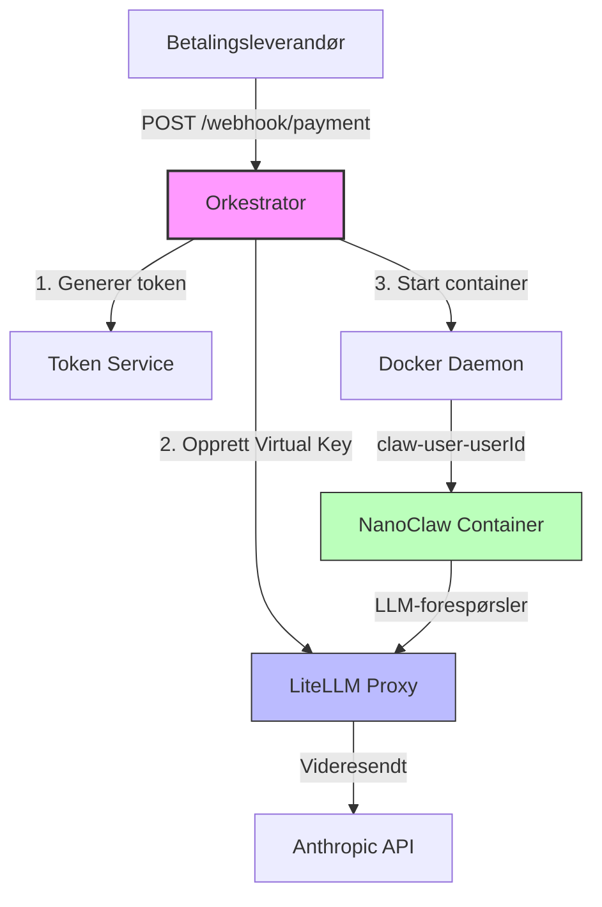

# Utvikling del 2: Backend Orkestrator — Walkthrough

## Oversikt

Backend Orkestratoren for "Zero Delay" er nå implementert. Den er en lettvekts Express-server (Node.js) som håndterer den automatiserte onboarding-flyten for Claw Personal.

## Hva ble bygget

### Nye filer (7 stk)

| Fil | Formål |
|-----|--------|
| [package.json](file:///Users/thomasuthaug/Desktop/Nrth%20AI%20-%20Claw%20Personal/orchestrator/package.json) | Node.js prosjektfil med express, dockerode, dotenv, uuid |
| [Dockerfile](file:///Users/thomasuthaug/Desktop/Nrth%20AI%20-%20Claw%20Personal/orchestrator/Dockerfile) | Multi-stage Docker build, Node.js 22 Alpine |
| [src/server.js](file:///Users/thomasuthaug/Desktop/Nrth%20AI%20-%20Claw%20Personal/orchestrator/src/server.js) | Express-server med logging, feilhåndtering, helse-endepunkt |
| [src/config/index.js](file:///Users/thomasuthaug/Desktop/Nrth%20AI%20-%20Claw%20Personal/orchestrator/src/config/index.js) | Sentralisert konfigurasjon fra miljøvariabler |
| [src/services/token.service.js](file:///Users/thomasuthaug/Desktop/Nrth%20AI%20-%20Claw%20Personal/orchestrator/src/services/token.service.js) | Intern token-generering og userId↔token lagring |
| [src/services/litellm.service.js](file:///Users/thomasuthaug/Desktop/Nrth%20AI%20-%20Claw%20Personal/orchestrator/src/services/litellm.service.js) | LiteLLM Virtual Key opprettelse via admin-API |
| [src/services/docker.service.js](file:///Users/thomasuthaug/Desktop/Nrth%20AI%20-%20Claw%20Personal/orchestrator/src/services/docker.service.js) | Dockerode container-opprettelse og livssyklus |
| [src/routes/webhook.routes.js](file:///Users/thomasuthaug/Desktop/Nrth%20AI%20-%20Claw%20Personal/orchestrator/src/routes/webhook.routes.js) | POST /webhook/payment rute-handler |

### Modifiserte filer (2 stk)

| Fil | Endring |
|-----|---------|
| [docker-compose.yml](file:///Users/thomasuthaug/Desktop/Nrth%20AI%20-%20Claw%20Personal/docker-compose.yml) | Lagt til `orchestrator`-tjeneste med Docker socket, begge nettverk, og depends_on |
| [.env.example](file:///Users/thomasuthaug/Desktop/Nrth%20AI%20-%20Claw%20Personal/.env.example) | Lagt til ORCHESTRATOR_PORT, NANOCLAW_IMAGE, budsjett-variabler |

## Arkitektur



## Nøkkelfunksjoner

### 1. Webhook-mottak (`POST /webhook/payment`)
- Mottar betalingsbekreftelse med `userId` og `status: "completed"`
- Validerer innkommende data
- Returnerer containerId og status ved suksess

### 2. Intern Token-generering
- Bruker `crypto.randomBytes(32)` for kryptografisk sikre tokens
- Lagrer userId↔token kobling in-memory (Map)
- Designet for enkel migrering til database/vault

### 3. LiteLLM Virtual Key
- Oppretter Virtual Key per bruker via LiteLLM admin-API
- Setter budsjettgrenser ($10/30 dager per bruker)
- Begrenser modell-tilgang til `claude-sonnet` og `claude-haiku`
- Fallback til intern token ved feil (for testing)

### 4. Container-klargjøring
- Bruker Dockerode (ikke shell-kommandoer) for robusthet
- Container: `claw-user-{userId}` med `nanoclaw-base:latest`
- Nettverk: `claw-internal` (lukket, ingen internett)
- Miljøvariabler: `INTERNAL_TOKEN`, `OPENAI_API_KEY`, `OPENAI_API_BASE`, `MODEL_NAME`, `USER_ID`
- Ressursbegrensninger: 512 MB RAM, 0.5 CPU
- Fjerner eksisterende container automatisk ved re-opprettelse

## Hvordan verifisere

### Alternativ 1: Docker Compose (anbefalt)
```bash
# Kopier .env.example til .env og fyll inn verdier
cp .env.example .env

# Start alle tjenester
docker compose up -d

# Sjekk helse
curl http://localhost:3000/health
curl http://localhost:4000/health

# Send test-webhook
curl -X POST http://localhost:3000/webhook/payment \
  -H "Content-Type: application/json" \
  -d '{"userId": "test-001", "status": "completed"}'
```

### Alternativ 2: Lokal utvikling (krever Node.js)
```bash
# Installer avhengigheter
cd orchestrator
npm install

# Start i utviklingsmodus
npm run dev

# Test endepunkt
curl http://localhost:3000/health
```

## Neste steg

> [!TIP]
> Basert på utviklingsplanen er neste fase:
> - **Utvikling del 3**: LLM Gateway og intern sikkerhet ("The Vault")
> - **Utvikling del 4**: Frontend "Magic Connect" Onboarding (OAuth 2.0)
