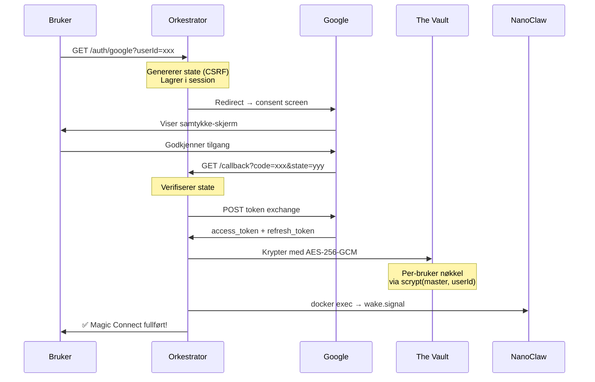
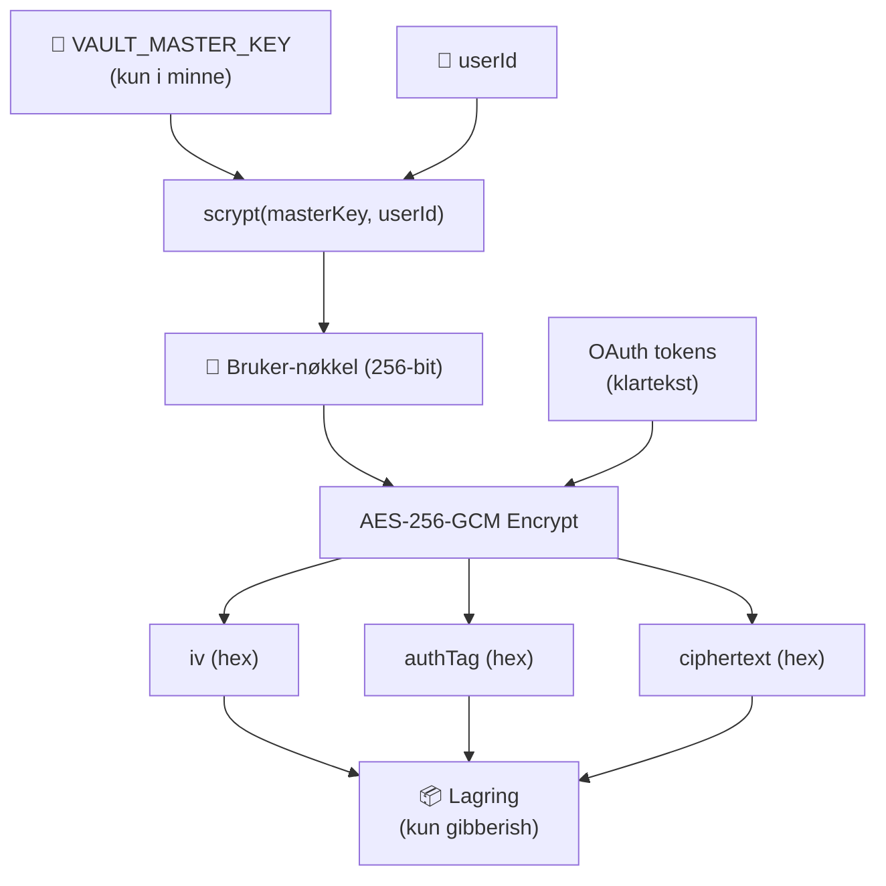

# Fase 3: Onboarding & OAuth — Walkthrough

## Hva ble bygget

Fase 3 implementerer «Magic Connect»-delen av onboardingen — komplett Google OAuth 2.0 integrasjon med Zero-Knowledge kryptering og container-signalering.

---

## Endrede filer

### Nye filer (3 stk)

| Fil | Størrelse | Beskrivelse |
|---|---|---|
| [vault.service.js](file:///Users/thomasuthaug/Desktop/Nrth%20AI%20-%20Claw%20Personal/orchestrator/src/services/vault.service.js) | 8.6 KB | Zero-Knowledge kryptering (The Vault) |
| [google-auth.service.js](file:///Users/thomasuthaug/Desktop/Nrth%20AI%20-%20Claw%20Personal/orchestrator/src/services/google-auth.service.js) | 7.1 KB | Google OAuth2 klient |
| [auth.routes.js](file:///Users/thomasuthaug/Desktop/Nrth%20AI%20-%20Claw%20Personal/orchestrator/src/routes/auth.routes.js) | 9.7 KB | OAuth-ruter (Magic Connect) |

### Modifiserte filer (5 stk)

| Fil | Endringer |
|---|---|
| [config/index.js](file:///Users/thomasuthaug/Desktop/Nrth%20AI%20-%20Claw%20Personal/orchestrator/src/config/index.js) | Lagt til `google`, `vault`, `session` konfig |
| [server.js](file:///Users/thomasuthaug/Desktop/Nrth%20AI%20-%20Claw%20Personal/orchestrator/src/server.js) | Session middleware + auth routes montert |
| [docker.service.js](file:///Users/thomasuthaug/Desktop/Nrth%20AI%20-%20Claw%20Personal/orchestrator/src/services/docker.service.js) | Ny `wakeContainer()` metode |
| [docker-compose.yml](file:///Users/thomasuthaug/Desktop/Nrth%20AI%20-%20Claw%20Personal/docker-compose.yml) | Google/Session/Vault env-variabler |
| [.env.example](file:///Users/thomasuthaug/Desktop/Nrth%20AI%20-%20Claw%20Personal/.env.example) | Fase 3 miljøvariabler dokumentert |
| [package.json](file:///Users/thomasuthaug/Desktop/Nrth%20AI%20-%20Claw%20Personal/orchestrator/package.json) | `googleapis` + `express-session` lagt til |

---

## Filstruktur

```
orchestrator/src/
├── config/
│   └── index.js                  ← +google, vault, session config
├── routes/
│   ├── webhook.routes.js         ← Fase 2 (uendret)
│   └── auth.routes.js            ← NY: OAuth-ruter
├── services/
│   ├── docker.service.js         ← +wakeContainer()
│   ├── litellm.service.js        ← Fase 2 (uendret)
│   ├── token.service.js          ← Fase 2 (uendret)
│   ├── vault.service.js          ← NY: Zero-Knowledge kryptering
│   └── google-auth.service.js    ← NY: Google OAuth2
└── server.js                     ← +session, +auth routes
```

---

## Arkitektur

### OAuth-flyten (Magic Connect)



### The Vault — Krypteringsarkitektur



**Nøkkelpunkter:**
- Master Key holdes kun i Orkestratorens minne — aldri i database
- Hver bruker får en unik nøkkel avledet via scrypt (minnekrevende → brute-force-resistent)
- AES-256-GCM gir både kryptering OG autentisering (tamper detection)
- Selv med full databasetilgang ser en angriper kun `{ iv, authTag, ciphertext }`

---

## API-endepunkter (Fase 3)

| Metode | Rute | Beskrivelse |
|---|---|---|
| `GET` | `/auth/google?userId=xxx` | Starter OAuth-flyt, redirecter til Google |
| `GET` | `/auth/google/callback` | Mottar tokens fra Google, krypterer i Vault, vekker container |
| `GET` | `/auth/status/:userId` | Sjekker om bruker har tokens (returnerer bool) |

---

## Google Scopes

| Scope | Formål |
|---|---|
| `openid` + `email` + `profile` | Google-innlogging og brukerinfo |
| `gmail.readonly` | Les innboks (aldri send/slett) |
| `calendar.readonly` | Les kalenderhendelser |
| `yt-analytics.readonly` | YouTube kanalstatistikk |
| `youtube.readonly` | YouTube kanalinfo og videoer |

---

## Neste steg for å kjøre

1. **Google Cloud Console:**
   - Opprett prosjekt → Aktiver Gmail, Calendar, YouTube Analytics, YouTube Data API
   - Opprett OAuth 2.0 Client ID (Web application)
   - Sett redirect URI: `http://localhost:3000/auth/google/callback`

2. **Miljøvariabler:**
   ```bash
   cp .env.example .env
   # Fyll inn GOOGLE_CLIENT_ID, GOOGLE_CLIENT_SECRET
   # Generer: openssl rand -hex 32  → SESSION_SECRET og VAULT_MASTER_KEY
   ```

3. **Bygg og kjør:**
   ```bash
   docker compose build orchestrator
   docker compose up -d
   ```

4. **Test OAuth-flyten:**
   ```bash
   # Åpne i nettleser:
   open http://localhost:3000/auth/google?userId=test-user-001
   
   # Sjekk status etter OAuth:
   curl http://localhost:3000/auth/status/test-user-001
   ```
