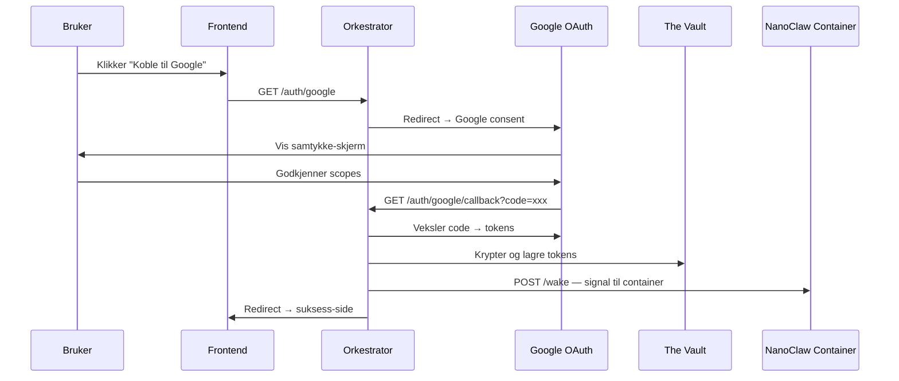

# Fase 3: Onboarding & OAuth-integrasjon (Magic Connect)

## Mål

Bygge «Magic Connect»-delen av onboardingen for YouTube-innholdsprodusenter. Brukeren skal kunne logge inn med Google og gi tilgang til Gmail, Calendar og YouTube Analytics. Tokene lagres sikkert i «The Vault» med Zero-Knowledge-kryptering, og brukerens NanoClaw-container får signal om å våkne.

## Bakgrunn

Fase 1 (Infra/LiteLLM) og Fase 2 (Orkestrator) er ferdig utviklet. Orkestratoren har allerede:
- Webhook-endepunkt for betaling (`POST /webhook/payment`)
- Docker-service for å spinne opp brukercontainere
- Token-service for intern autentisering
- LiteLLM-service for Virtual Keys

Fase 3 bygger videre på dette med OAuth-ruter og en «Vault»-service for sikker token-lagring.

---

## Brukerflyt (som beskrevet i spec)



---

## Foreslåtte endringer

### Nye avhengigheter i `package.json`

| Pakke | Formål |
|---|---|
| `googleapis` | Google OAuth2 klient + API-tilgang |
| `express-session` | Sesjonshåndtering for OAuth state/CSRF |

> [!NOTE]
> Vi bruker det offisielle `googleapis`-biblioteket fra Google i stedet for Passport.js. Det gir oss direkte kontroll over token-exchange og refresh-logikk, som er essensielt for «The Vault».

---

### Orkestrator — Konfig

#### [MODIFY] [index.js](file:///Users/thomasuthaug/Desktop/Nrth%20AI%20-%20Claw%20Personal/orchestrator/src/config/index.js)

Legger til et nytt `google`-objekt og `vault`-objekt i konfigurasjonen:

```js
google: {
  clientId: process.env.GOOGLE_CLIENT_ID,
  clientSecret: process.env.GOOGLE_CLIENT_SECRET,
  redirectUri: process.env.GOOGLE_REDIRECT_URI || 'http://localhost:3000/auth/google/callback',
  scopes: [
    'openid',
    'email',
    'profile',
    'https://www.googleapis.com/auth/gmail.readonly',
    'https://www.googleapis.com/auth/calendar.readonly',
    'https://www.googleapis.com/auth/yt-analytics.readonly',
    'https://www.googleapis.com/auth/youtube.readonly',
  ],
},
vault: {
  encryptionAlgorithm: 'aes-256-gcm',
  keyDerivation: 'scrypt',
},
session: {
  secret: process.env.SESSION_SECRET || crypto.randomBytes(32).toString('hex'),
},
```

---

### Orkestrator — Nye services

#### [NEW] vault.service.js

«The Vault» — Zero-Knowledge krypteringsservice. Ansvar:

- **`deriveUserKey(userId)`** — Avleder en unik krypteringsnøkkel per bruker via `scrypt` med en master-hemmelighet + userId som salt. Vault-masternøkkelen holdes kun i minne i Orkestratoren.
- **`encrypt(userId, plaintext)`** — Krypterer en vilkårlig streng (f.eks. serialiserte OAuth-tokens) med brukerens avledede nøkkel via AES-256-GCM. Returnerer `{ iv, authTag, ciphertext }`.
- **`decrypt(userId, encryptedPayload)`** — Dekrypterer data tilbake til klartekst.
- **`storeUserTokens(userId, tokens)`** — Krypterer og lagrer hele token-settet (access_token, refresh_token, expiry_date, scope) i en in-memory Map (med kommentarer om å flytte til PostgreSQL/Redis i produksjon).
- **`getUserTokens(userId)`** — Henter og dekrypterer tokens for en bruker.

> [!IMPORTANT]
> In-memory lagring er kun for MVP. I produksjon skal dette erstattes med PostgreSQL + kryptert kolonne eller HashiCorp Vault KMS. Kommentarer i koden vil markere dette tydelig.

#### [NEW] google-auth.service.js

Google OAuth2-service. Ansvar:

- **`getAuthUrl(state)`** — Genererer Google OAuth consent URL med riktige scopes og `access_type: 'offline'` for refresh token.
- **`exchangeCode(code)`** — Veksler autorisasjonskoden til access_token + refresh_token.
- **`refreshAccessToken(refreshToken)`** — Bruker refresh_token for å fornye access_token (for fremtidig bruk av NanoClaw).
- **`getUserProfile(accessToken)`** — Henter brukerens Google-profil (e-post, navn) for verifisering.

---

### Orkestrator — Nye ruter

#### [NEW] auth.routes.js

| Rute | Metode | Beskrivelse |
|---|---|---|
| `/auth/google` | GET | Genererer state-parameter, lagrer i sesjon, redirecter til Google consent |
| `/auth/google/callback` | GET | Mottar auth-kode, validerer state, veksler tokens, krypterer og lagrer i Vault, sender wake-signal til NanoClaw-container, redirecter til suksess-side |
| `/auth/status/:userId` | GET | Sjekker om en bruker har lagret OAuth-tokens (returnerer bool, ikke selve tokens) |

---

### Orkestrator — Container-signal

#### [MODIFY] [docker.service.js](file:///Users/thomasuthaug/Desktop/Nrth%20AI%20-%20Claw%20Personal/orchestrator/src/services/docker.service.js)

Legger til en ny metode:

- **`wakeContainer(userId)`** — Finner brukerens container (`claw-user-{userId}`) og kjører en `docker exec` med et signal om at OAuth-tokens er klare. Containeren kan da hente tokenene fra Vault via et internt API-kall.

---

### Orkestrator — Server-oppdatering

#### [MODIFY] [server.js](file:///Users/thomasuthaug/Desktop/Nrth%20AI%20-%20Claw%20Personal/orchestrator/src/server.js)

- Legger til `express-session` middleware
- Monterer nye auth-ruter: `app.use('/auth', authRoutes)`
- Logger nye endepunkter ved oppstart

---

### Miljøvariabler

#### [MODIFY] [.env.example](file:///Users/thomasuthaug/Desktop/Nrth%20AI%20-%20Claw%20Personal/.env.example)

Legger til en ny seksjon:

```env
# ============================================================
# Fase 3: Google OAuth (Magic Connect)
# ============================================================
GOOGLE_CLIENT_ID=xxxxxxxxx.apps.googleusercontent.com
GOOGLE_CLIENT_SECRET=GOCSPX-xxxxxxxxxxxxx
GOOGLE_REDIRECT_URI=http://localhost:3000/auth/google/callback

# Sesjonshemmelighet for express-session (CSRF-beskyttelse)
SESSION_SECRET=generer-en-sterk-hemmelighet-her

# Vault Master Key — brukes til å avlede bruker-spesifikke nøkler
# Generer med: openssl rand -hex 32
VAULT_MASTER_KEY=xxxxxxxxxxxxxxxxxxxxxxxxxxxxxxxx
```

---

### Docker Compose

#### [MODIFY] [docker-compose.yml](file:///Users/thomasuthaug/Desktop/Nrth%20AI%20-%20Claw%20Personal/docker-compose.yml)

Legger til de nye miljøvariablene i orchestrator-tjenesten:

```yaml
- GOOGLE_CLIENT_ID=${GOOGLE_CLIENT_ID}
- GOOGLE_CLIENT_SECRET=${GOOGLE_CLIENT_SECRET}
- GOOGLE_REDIRECT_URI=${GOOGLE_REDIRECT_URI}
- SESSION_SECRET=${SESSION_SECRET}
- VAULT_MASTER_KEY=${VAULT_MASTER_KEY}
```

---

## Filstruktur etter endringer

```
orchestrator/src/
├── config/
│   └── index.js                  ← MODIFISERT (google, vault, session config)
├── routes/
│   ├── webhook.routes.js         ← UENDRET
│   └── auth.routes.js            ← NY (OAuth-ruter)
├── services/
│   ├── docker.service.js         ← MODIFISERT (wakeContainer)
│   ├── litellm.service.js        ← UENDRET
│   ├── token.service.js          ← UENDRET
│   ├── vault.service.js          ← NY (Zero-Knowledge kryptering)
│   └── google-auth.service.js    ← NY (Google OAuth2)
└── server.js                     ← MODIFISERT (session, auth routes)
```

---

## Åpne spørsmål

> [!IMPORTANT]
> **Frontend suksess-side:** Skal callback redirecte til en spesifikk frontend-URL etter vellykket OAuth? Foreløpig returnerer vi et enkelt JSON/HTML-svar. Fyll gjerne inn en `FRONTEND_SUCCESS_URL` env-variabel.

> [!NOTE]
> **Google Cloud Console:** For at OAuth skal fungere, må det opprettes et prosjekt i Google Cloud Console med de aktuelle API-ene aktivert (Gmail API, Calendar API, YouTube Analytics API, YouTube Data API v3). Du trenger en OAuth 2.0 Client ID (type: Web application) med redirect URI satt til `http://localhost:3000/auth/google/callback`.

---

## Verifiseringsplan

### Automatiserte tester
1. `npm install` — verifiser at avhengigheter installeres
2. `node src/server.js` — verifiser at serveren starter uten feil og logger nye endepunkter
3. `curl http://localhost:3000/health` — helse-sjekk
4. `curl http://localhost:3000/auth/status/test-user` — verifiser at status-endepunkt returnerer `false`

### Manuell verifisering
1. Åpne `http://localhost:3000/auth/google` i nettleser → skal redirecte til Google consent
2. Etter godkjenning → callback mottas, tokens krypteres og lagres
3. Logg viser at wake-signal sendes til brukerens container
