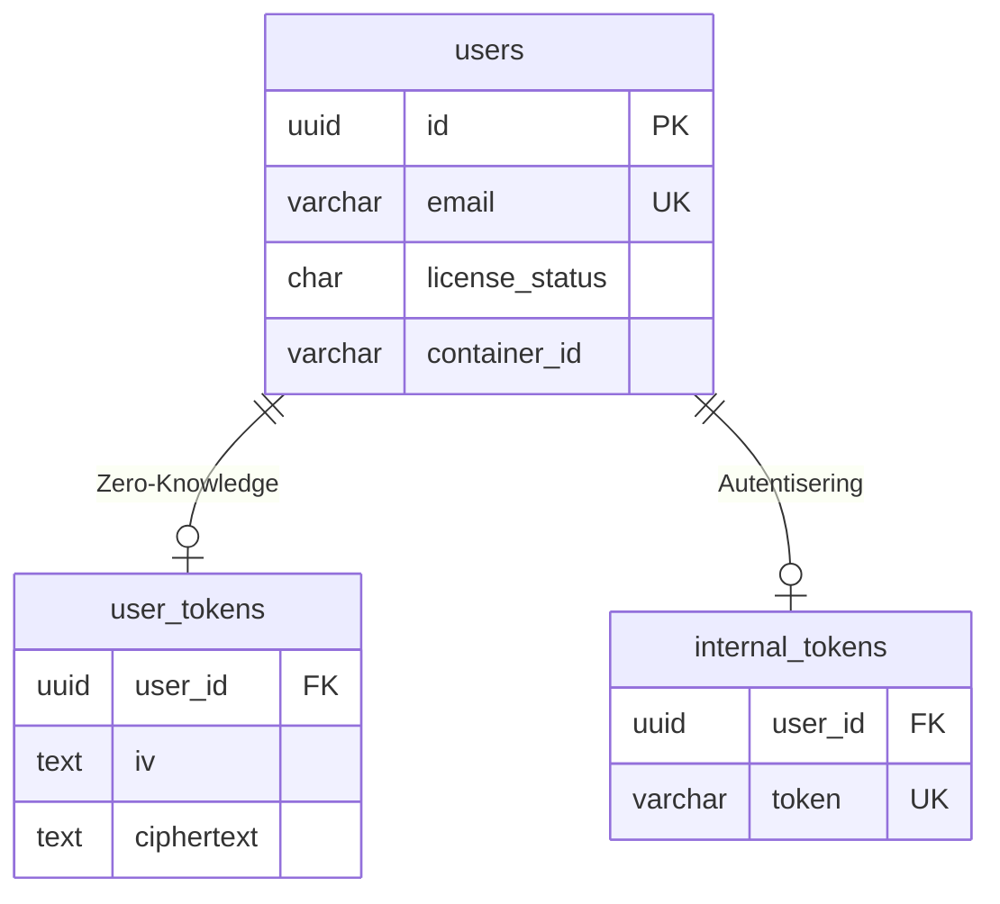

# Report & Implementation Plan: Fase 4, Oppgave 2
## Bygge Database Models (PostgreSQL)

Dette dokumentet inneholder både implementasjonsplanen og sluttrapporten for migrering av Claw Personal Orkestratoren fra in-memory lagring til en persistent PostgreSQL-database.

---

## 1. Implementasjonsplan (Planlagt)

### Bakgrunn og Mål
Målet med denne oppgaven var å flytte alle midlertidige datakart (`Map()`) i Orkestratoren over til en robust PostgreSQL-løsning. Dette inkluderer:
- Brukerprofiler og lisensstatus.
- Krypterte OAuth-tokens i "The Vault".
- Interne autentiseringstokens for NanoClaw-containere.

### Arkitektur-valg
1. **Node-Postgres (pg):** Bruke standard `pg`-biblioteket med en tilkoblingspool for optimal ytelse.
2. **Idempotent Schema:** Bruke `IF NOT EXISTS` i SQL for å sikre at systemet kan startes om uten tap av data eller feil.
3. **Automatisert Migrasjon:** Kjøre database-skjemaet automatisk ved hver serveroppstart.
4. **Zero-Knowledge:** Beholde krypteringslogikken i applikasjonslaget (VaultService) slik at databasen aldri ser dekrypterte tokens.

---

## 2. Gjennomføring (Fullført)

Oppgaven ble gjennomført 12. april 2026. Følgende komponenter er utviklet og testet:

### Database-infrastruktur
- **`src/db/pool.js`**: Etablert connection pool med helsesjekk og graceful shutdown.
- **`src/db/schema.sql`**: Definert tre hovedtabeller:
    - `users`: Basisinfo, lisensstatus (`active`, `pending` etc.) og container-referanser.
    - `user_tokens`: Kryptert lagring av IV, Auth Tag og Ciphertext.
    - `internal_tokens`: Kobling mellom bruker og container-autentisering.
- **`src/db/migrate.js`**: Skript som automatisk klargjør databasen ved oppstart.

### Tjeneste-migrering
- **`token.service.js`**: Migrert til full async/await med SQL-spørringer. Bruker UPSERT for å garantere korrekt tilstand.
- **`vault.service.js`**: Oppdatert til å lagre og hente kryptert payload fra `user_tokens`-tabellen.
- **`config/index.js`**: Lagt til støtte for `DATABASE_URL` og pool-innstillinger.

### Rute-oppdateringer
- **`webhook.routes.js`**: Oppretter nå en rad i `users`-tabellen så snart betaling er bekreftet.
- **`auth.routes.js`**: Lagrer Google-profilinfo (navn, e-post, ID) i brukertabellen ved vellykket OAuth-flyt.
- **`server.js`**: Endret oppstartsekvens: Test tilkobling → Kjør migrasjon → Start server.

---

## 3. Databaseskjema (Oversikt)

## 4. Status etter Fase 4
- **Persistens:** Data overlever nå container-omstarter og server-crash.
- **Sikkerhet:** All sensitiv data er lagret kryptert (AES-256-GCM).
- **Infrastruktur:** Koblet mot den sentrale `claw-postgres` containeren i `claw-internal` nettverket.

**Tjenesten er nå klar for Fase 5: Betalingsintegrasjon (Stripe).**
