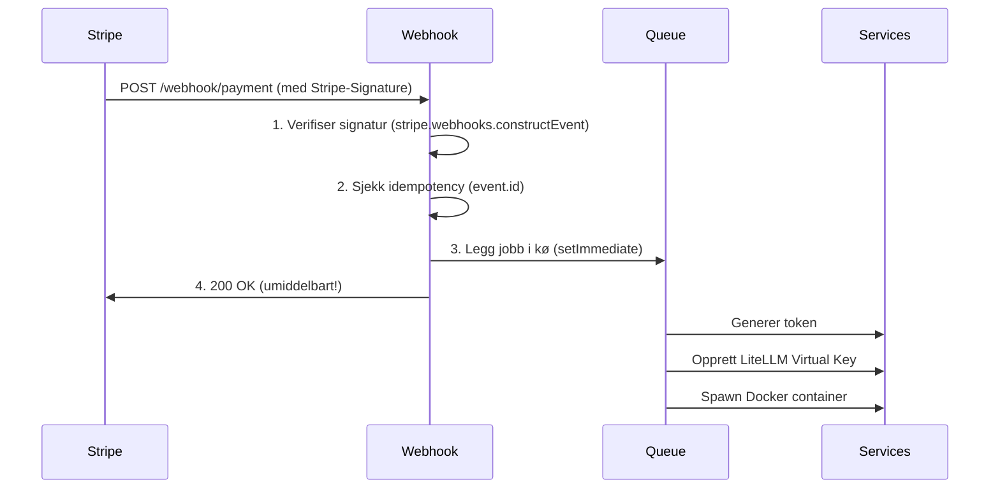

# 🔬 Research Agent — Stripe Analyse
## Fase 5, Oppgave 1: Stripe Webhooks & Arkitektur for Zero-Delay Onboarding

---

## 📋 Oppgavebeskrivelse

Analysen skal svare på:
1. **Checkout Sessions vs. Payment Intents** — hvilken arkitektur passer Claw Personal?
2. **Zero-Delay Webhook-mønster** — hvordan garantere responstid under onboarding?
3. **Praktiske krav** til signaturverifisering og sikkerhet for Fase 5, Oppgave 2 (implementering)

---

## 1. Checkout Sessions vs. Payment Intents

### Vurdering for Claw Personal

| Kriterium | Checkout Sessions ✅ | Payment Intents |
|---|---|---|
| **Kompleksitet** | Lav — Stripe eier checkout-flyten | Høy — du bygger alt selv |
| **Tidsbruk** | Timer | Dager/uker |
| **Abonnement** | Innebygd støtte (`mode: subscription`) | Manuell håndtering |
| **3D Secure / SCA** | Automatisk | Manuell |
| **Skatt / moms** | Stripe Tax støttes | Manuell |
| **Fleksibilitet** | Begrenset tilpasning av UI | Full kontroll |
| **Passer Claw?** | ✅ **JA** | ❌ Overkill for MVP |

### ✅ Anbefaling: Stripe Checkout Sessions med `mode: subscription`

**Begrunnelse:**
- Claw Personal trenger et enkelt, trygt abonnement (f.eks. 299 kr/mnd).
- Frontend (fase 6) skal kun lenke brukeren til en hosted Stripe Checkout-side.
- Stripe håndterer kortvalidering, 3D Secure, kvitteringer og fornyelse automatisk.
- Webhook-eventet `checkout.session.completed` trigger provisionering i Orkestratoren.

**Reell flyt for Claw Personal:**
```
Bruker klikker "Kjøp" på frontend
  → Frontend kaller Orkestrator: POST /api/create-checkout-session
  → Orkestrator oppretter Stripe Checkout Session (server-side)
  → Bruker redirectes til Stripe-hosted betalingsside
  → Bruker betaler
  → Stripe sender webhook: checkout.session.completed
  → Orkestrator provisjonerer: token + LiteLLM Virtual Key + Docker container
  → Bruker redirectes til Magic Connect (OAuth)
```

---

## 2. Zero-Delay Webhook-Mønster

### Det kritiske problemet med nåværende kode

Den eksisterende `/webhook/payment`-ruten gjør **alt synkront**:
1. Oppretter intern token
2. Kaller LiteLLM API (eksternt kall ~100-500ms)
3. Starter Docker-container via Dockerode (~500-2000ms)

**Risiko:** Stripe venter maks ~30 sekunder på `200 OK`. Hvis Docker eller LiteLLM er trege, feiler Stripe webhooken og begynner å retrie — noe som kan dobbelt-provisionere brukeren.

### ✅ Zero-Delay Arkitektur: Ack-First, Process-Later

```
Stripe POST /webhook/payment
    │
    ├─ 1. Verifiser Stripe-signatur (kryptografisk, <5ms)
    ├─ 2. Sjekk idempotency: har vi sett dette event.id før?
    ├─ 3. Legg jobb på intern kø (async, <10ms)
    └─ 4. Returner 200 OK umiddelbart ← Stripe er fornøyd
    
    [Bakgrunnskø / setImmediate / Promise]
        ├─ Generer intern token
        ├─ Opprett LiteLLM Virtual Key
        └─ Spawn Docker container
```

**For MVP uten Redis/BullMQ:** `setImmediate()` eller `process.nextTick()` i Node.js er nok for 15 brukere. Stripe får sin `200 OK` innen millisekunder, og provisionering skjer i bakgrunnen.

**For produksjon (50+ brukere):** Bruk [BullMQ](https://docs.bullmq.io/) med Redis — da får du retry-logikk, monitoring og garantert levering.

---

## 3. Sikker Signaturverifisering

### ⚠️ Kritisk problem: Raw Body

`express.json()` parser body-en og ødelegger Stripe-signaturen. Webhook-ruten MÅ bruke `express.raw()`.

**Mønster for `server.js`:**
```javascript
// Webhook-ruten MÅ defineres FØR express.json() globalt
app.use('/webhook/payment', express.raw({ type: 'application/json' }));
app.use(express.json()); // Alle andre ruter
```

**Mønster for `webhook.routes.js`:**
```javascript
const stripe = require('stripe')(process.env.STRIPE_SECRET_KEY);

router.post('/payment', express.raw({ type: 'application/json' }), async (req, res) => {
  const sig = req.headers['stripe-signature'];
  let event;

  try {
    event = stripe.webhooks.constructEvent(
      req.body,                          // Raw buffer — ikke JSON-parset!
      sig,
      process.env.STRIPE_WEBHOOK_SECRET  // whsec_... fra Stripe Dashboard
    );
  } catch (err) {
    console.error(`[Webhook] Signaturverifisering feilet: ${err.message}`);
    return res.status(400).send(`Webhook Error: ${err.message}`);
  }

  // Returner 200 umiddelbart
  res.json({ received: true });

  // Behandle asynkront
  setImmediate(() => handleStripeEvent(event));
});
```

---

## 4. Idempotency — Forebygg Dobbelt-Provisionering

Stripe sender samme webhook flere ganger ved nettverksfeil. Uten idempotency kan én bruker få to containere.

### Løsning (In-Memory for MVP, PostgreSQL for produksjon):
```javascript
const processedEvents = new Set(); // Byttes ut med DB-oppslag i Fase 4

async function handleStripeEvent(event) {
  // Sjekk om vi allerede har håndtert dette eventet
  if (processedEvents.has(event.id)) {
    console.log(`[Webhook] Duplikat event ignorert: ${event.id}`);
    return;
  }
  processedEvents.add(event.id);

  if (event.type === 'checkout.session.completed') {
    const session = event.data.object;
    const userId = session.client_reference_id; // Sett av Orkestratoren ved opprettelse av session
    await provisionUser(userId);
  }
}
```

> **Merk:** Når PostgreSQL er på plass (Fase 4), erstattes `processedEvents` Set med en database-tabell som lagrer prosesserte `event.id`-er permanent.

---

## 5. Anbefalte Stripe Webhook-Events

| Event | Hva det betyr | Handling i Orkestratoren |
|---|---|---|
| `checkout.session.completed` | Bruker har betalt | **Provisioner**: token + LiteLLM + Docker container |
| `invoice.paid` | Månedlig fornyelse OK | Forleng brukerens aktive status i DB |
| `invoice.payment_failed` | Betaling feilet | Send e-post, gi grace period (7 dager) |
| `customer.subscription.deleted` | Bruker har sagt opp | Stopp og slett Docker-container |
| `customer.subscription.updated` | Oppgradering/nedgradering | Juster LiteLLM budget-grenser |

---

## 6. Nye Miljøvariabler som trengs

Følgende må legges til i `.env.example` og settes i produksjon:

```env
# Stripe
STRIPE_SECRET_KEY=sk_live_...          # Fra Stripe Dashboard → API Keys
STRIPE_WEBHOOK_SECRET=whsec_...        # Fra Stripe Dashboard → Webhooks → Signing secret
STRIPE_PRICE_ID=price_...             # ID-en til abonnementsproduktet du oppretter i Stripe
STRIPE_SUCCESS_URL=https://app.clawpersonal.no/magic-connect
STRIPE_CANCEL_URL=https://app.clawpersonal.no/
```

---

## 7. Konklusjon & Leveranse til Fase 5 Oppgave 2

> [!IMPORTANT]
> **Arkitekturanbefalingen til Orkestrator Builder er klar:**
>
> 1. **Bruk Checkout Sessions** (`mode: subscription`) — ikke Payment Intents.
> 2. **Implementer `express.raw()`** på webhook-ruten FØR `express.json()`.
> 3. **Verifiser alltid** med `stripe.webhooks.constructEvent()`.
> 4. **Returner `200 OK` umiddelbart** — kjør provisjonering med `setImmediate()`.
> 5. **Bruk `checkout.session.completed`** som primær trigger for provisjonering.
> 6. **Implementer idempotency** ved å sjekke `event.id` mot In-Memory Set (nå) → PostgreSQL (Fase 4).

### Ny Webhook-Flyt (Optimalisert fra nåværende implementasjon):



---

*Research Agent — Analyse fullført: 2026-04-12*
